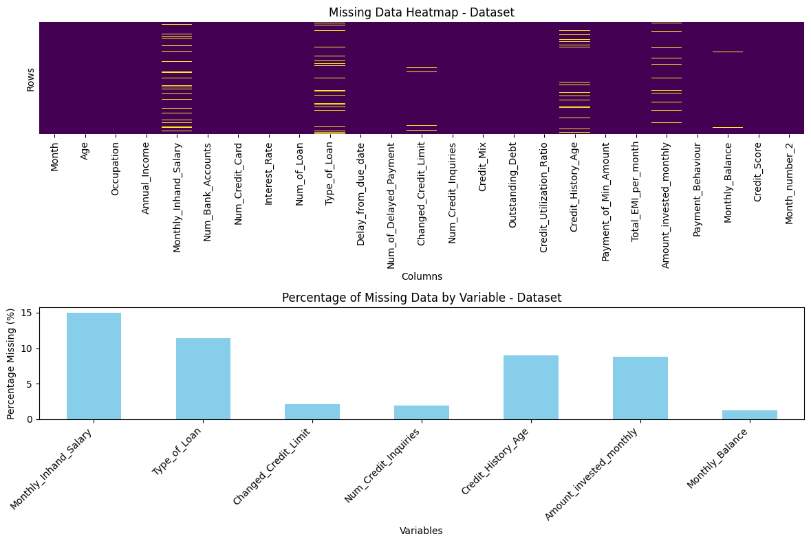

# Data Cleanup Workflow

## 1. Load and Inspect the Dataset

#### Overview
- **Number of rows**: 100,000  
- **Total data memory usage**: 120.56 MB  
- **Total Columns:** 28
- **Total Entries (cells):** 2,800,000

#### Columns

| Column Name                | Data Type |
| -------------------------- | --------- |
| Age                        | object    |
| Occupation                 | object    |
| Annual_Income              | object    |
| Monthly_Inhand_Salary      | float64   |
| Num_Bank_Accounts          | int64     |
| Num_Credit_Card            | int64     |
| Interest_Rate              | int64     |
| Num_of_Loan                | object    |
| Type_of_Loan               | object    |
| Delay_from_due_date        | int64     |
| Num_of_Delayed_Payment     | object    |
| Changed_Credit_Limit       | object    |
| Num_Credit_Inquiries       | float64   |
| Credit_Mix                 | object    |
| Outstanding_Debt           | object    |
| Credit_Utilization_Ratio   | float64   |
| Credit_History_Age         | object    |
| Payment_of_Min_Amount      | object    |
| Total_EMI_per_month        | float64   |
| Amount_invested_monthly    | object    |
| Payment_Behaviour          | object    |
| Monthly_Balance            | object    |
| Credit_Score               | object    |

---
## 2. Remove Duplicates

**no duplicate rows were found based on dataset**

---

## 3. Drop Columns

### Which Columns Should Be Used and Why?

##### 1️⃣ Financial Stability & Income  
- **Age**: Correlates with credit history.  
- **Occupation**: Indicates job stability.  
- **Annual_Income** and **Monthly_Inhand_Salary**: Measure financial strength.

##### 2️⃣ Credit Exposure & Debt Management  
- **Num_Bank_Accounts** and **Num_Credit_Card**: Show financial activity.  
- **Interest_Rate**: Reflects borrowing cost.  
- **Num_of_Loan** and **Type_of_Loan**: Indicate current debt obligations.

##### 3️⃣ Payment Behavior & Creditworthiness  
- **Delay_from_due_date** and **Num_of_Delayed_Payment**: Track payment discipline.  
- **Changed_Credit_Limit**: Indicates lender trust.  
- **Num_Credit_Inquiries**: High inquiries may signal risk.

##### 4️⃣ Credit Score Factors  
- **Credit_Mix**: Diverse credit types are favorable.  
- **Outstanding_Debt** and **Credit_Utilization_Ratio**: Show liabilities and credit use.  
- **Credit_History_Age**: Longer history = better reliability.

##### 5️⃣ Spending & Financial Behavior  
- **Payment_of_Min_Amount**: Tracks minimum payments.  
- **Total_EMI_per_month** and **Monthly_Balance**: Show cash flow impact.  
- **Amount_invested_monthly** and **Payment_Behaviour**: Indicate financial habits.

### Drop 

```
columns_to_drop = [
    "ID",
    "Name",  
    "Num_of_Loan",  
    "SSN",  
    "Customer_ID",  
]
```

---

## 4. Correct Data Types

### ⚠️ Incorrect Data Types & Solutions

- **Annual_Income (object → float64)**  
  - Stored as an object due to formatting issues (e.g., commas, currency symbols).  
  - **Fix**: Clean non-numeric characters and convert to float.

- **Num_of_Loan (object → int64)**  
  - Should be an integer but is stored as an object, likely due to missing values or formatting inconsistencies.  
  - **Fix**: Handle NaNs and convert to int.

- **Num_of_Delayed_Payment (object → int64)**  
  - Represents a count but is stored as an object.  
  - **Fix**: Convert to integer after handling non-numeric values.

- **Changed_Credit_Limit (object → float64)**  
  - Should be numeric but may contain missing values or inconsistent formats.  
  - **Fix**: Convert to float.

- **Outstanding_Debt (object → float64)**  
  - Stored as an object due to currency symbols or missing values.  
  - **Fix**: Convert to float.

- **Amount_invested_monthly (object → float64)**  
  - Should be numeric but may have missing or improperly formatted values.  
  - **Fix**: Convert to float.

- **Monthly_Balance (object → float64)**  
  - Stored as an object due to formatting issues.  
  - **Fix**: Clean data and convert to float.

- **Age (object → int64)**  
  - Age should be stored as an integer.  
  - **Fix**: Convert to int after handling inconsistencies.

---

## 5. Clean Categorical Columns

- **Columns** 
  ``` 
  [
    "Occupation", 
    "Type_of_Loan", 
    "Credit_Mix", 
    "Payment_of_Min_Amount", 
    "Payment_Behaviour", 
    "Credit_Score"
  ]
    ```
### Categorical Columns Issues Report

#### 1. Occupation
**Summary:**

- Unique values: 16
- Most common value: "_______" (7.06%, 7,062 occurrences)
- Top categories: "_______" (7.06%), Lawyer (6.58%), Architect (6.35%), Engineer (6.35%), Scientist (6.3%)

**Issues:**

- The most frequent value, "_______", likely indicates missing or unknown occupations.

**Cleaning Steps:**

- **Handle "_______":**
  - Replace "_______" with "Unknown" to clearly mark missing data. This maintains transparency without assuming an occupation.
  - Alternative: Leave it as is if "_______" represents a valid category (e.g., unemployed), but "Unknown" is more explicit.
- **Standardize Format:**
  - Convert all values to title case (e.g., "lawyer" → "Lawyer") for consistency.
  - Remove any leading/trailing spaces.
- **Check for Duplicates:**
  - Review all 16 unique values for misspellings or variations (e.g., "Eng." vs. "Engineer"). Merge duplicates if found.


#### 2. Credit_Mix
**Summary:**

- Unique values: 4
- Most common value: "Standard" (36.48%, 36,479 occurrences)
- Top categories: "Standard" (36.48%), "Good" (24.34%), "_" (20.2%), "Bad" (18.99%)

**Issues:**

- "_" likely represents missing or unknown values.

**Cleaning Steps:**

- **Handle "_":**
  - Replace "_" with "Unknown" to explicitly mark missing data.
  - Alternative: Impute with the mode ("Standard"), but this risks introducing bias; "Unknown" is safer.
- **Standardize Format:**
  - Ensure all values are in title case (e.g., "standard" → "Standard") and free of extra spaces.

#### 3. Payment_of_Min_Amount
**Summary:**

- Unique values: 3
- Most common value: "Yes" (52.33%, 52,326 occurrences)
- Top categories: "Yes" (52.33%), "No" (35.67%), "NM" (12.01%)

**Issues:**

- "NM" likely means "Not Mentioned," indicating missing or unspecified values.

**Cleaning Steps:**

- **Handle "NM":**
  - Replace "NM" with "Unknown" to align with other columns.
  - Alternative: Treat "NM" as a separate category if it’s meaningful (e.g., data not provided), but "Unknown" standardizes missing values.
- **Standardize Format:**
  - Ensure "Yes" and "No" are consistently formatted (e.g., not "yes" or "NO").

#### 5. Payment_Behaviour
**Summary:**

- Unique values: 7
- Most common value: "Low_spent_Small_value_payments" (25.51%, 25,513 occurrences)
- Top categories: Various spending/payment behaviors (e.g., "High_spent_Medium_value_payments" at 17.54%)

**Issues:**

- No obvious missing values, but inconsistent formatting could exist.

**Cleaning Steps:**

- **Standardize Format:**
  - Use a consistent separator and case (e.g., "Low_spent_Small_value_payments" → "Low Spent Small Value Payments" with spaces or keep underscores but standardize across all entries).
  - Remove extra spaces or inconsistencies in naming.
- **Check for Duplicates:**
  - Ensure no similar behaviors are split due to typos (e.g., "Low Spent Small" vs. "Low_spent_Small_value_payments").

#### 6. Credit_Score
**Summary:**

- Unique values: 3
- Most common value: "Standard" (53.17%, 53,174 occurrences)
- Top categories: "Standard" (53.17%), "Poor" (29.0%), "Good" (17.83%)

**Issues:**

- No apparent issues; the column looks clean.

**Cleaning Steps:**

- **Verify:**
  - Confirm no hidden variations (e.g., "standard" vs. "Standard" or extra spaces).
- **Standardize Format:**
  - Ensure title case (e.g., "poor" → "Poor") for consistency.

---

## 6. Handle Special Columns

- **Credit_History_Age** (object → float):
  - Strings like "22 Years and 1 Months" or NaN.
  - **Fix**: Convert to total months for consistency (e.g.,   "22 Years and 1 Months" → 22 * 12 + 1 = 265).

- **Type_of_Loan** (object -> )
  - Strings like "Auto Loan, Credit-Builder Loan, Personal Loan,..."
  - **Fix** : 
  - **1-** Standardized text formatting:  
    - Converted all text to lowercase.  
    - Removed `"and "` to keep a consistent delimiter.  
    - Replaced `", "` with `","` to ensure uniform splitting.  
    - Stripped extra spaces.  
  - **2-** Extracted unique loan types dynamically:  
    - Used a custom function `get_Diff_Values_Colum()` to extract unique loan types.  
    - It processes each entry, removes unnecessary characters, and splits values correctly.  
  - **3-** Ensured proper value distribution analysis using:  
    ```python
    df['Type_of_Loan'].value_counts(dropna=False).head(20)
    ```  
  - **4-** Created a dictionary mapping unique loan types for validation.  

- **Month** (object -> int64):
  - 'January', 'February', 'March', 'April', 'May', 'June', 'July', 'August'
  - **Fix** : Convert to an Ordered Categorical Variable
  ```
  month_order = [
    'January', 'February', 
    'March', 'April', 
    'May', 'June', 
    'July', 'August',
    'September', 'October', 
    'November', 'December'
    ]
  ```

---

## 6. Handling Missing Data

### Missing Data Report

#### Variables with Missing Data 
- **Name:** 9985 missing values (9.98%)  
- **Monthly_Inhand_Salary:** 15002 missing values (15.00%)  
- **Type_of_Loan:** 11408 missing values (11.41%)  
- **Num_of_Delayed_Payment:** 7002 missing values (7.00%)  
- **Num_Credit_Inquiries:** 1965 missing values (1.97%)  
- **Credit_History_Age:** 9030 missing values (9.03%)  
- **Amount_invested_monthly:** 4479 missing values (4.48%)  
- **Monthly_Balance:** 1200 missing values (1.20%)  

#### Overall Missing Data 
- **Total Missing Values:** 60071  
- **Total Missing Percentage:** 2.15%  

#### Chart 



### 🔧 How to Fix ? 

- **Remove the "Name" column** : no analytical value.
- **Use MICE** : This method leverages relationships between variables and provides multiple imputed datasets for robust analysis

  ``` 
  [
    "Monthly_Inhand_Salary"
    "Type_of_Loan"
    "Num_of_Delayed_Payment"
    "Num_Credit_Inquiries"
    "Credit_History_Age"
    "Amount_invested_monthly"
    "Monthly_Balance"
  ]
    ```

---

## 7. Check for Outliers

### Monthly_Inhand_Salary
  - **Mean** : 4,194
  - **Std** : 3,184


---


